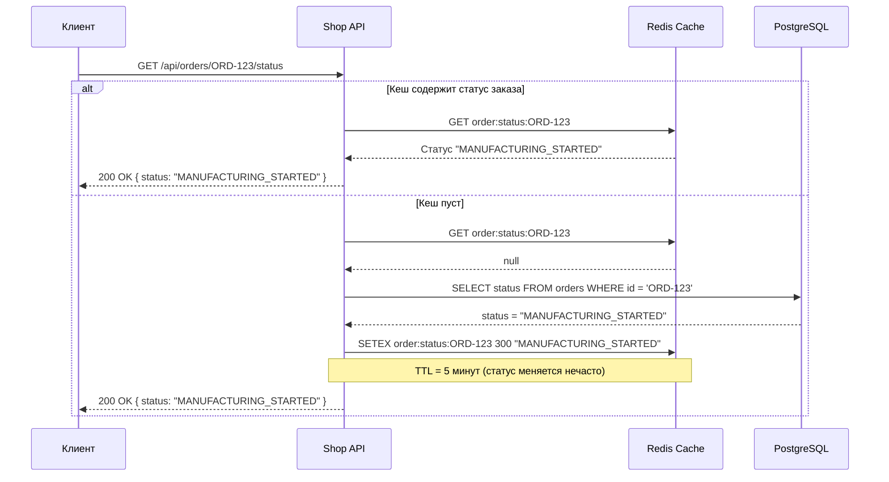

```mermaid
sequenceDiagram
    participant Client as Клиент 
    participant ShopAPI as Shop API
    participant Redis as Redis Cache
    participant Database as PostgreSQL

    Client->>ShopAPI: GET /api/orders/ORD-123/status
    
    alt Кеш содержит статус заказа
        ShopAPI->>Redis: GET order:status:ORD-123
        Redis-->>ShopAPI: Статус "MANUFACTURING_STARTED"
        ShopAPI-->>Client: 200 OK { status: "MANUFACTURING_STARTED" }
    else Кеш пуст
        ShopAPI->>Redis: GET order:status:ORD-123
        Redis-->>ShopAPI: null
        
        ShopAPI->>Database: SELECT status FROM orders WHERE id = 'ORD-123'
        Database-->>ShopAPI: status = "MANUFACTURING_STARTED"
        
        ShopAPI->>Redis: SETEX order:status:ORD-123 300 "MANUFACTURING_STARTED"
        Note over ShopAPI,Redis: TTL = 5 минут (статус меняется нечасто)
        
        ShopAPI-->>Client: 200 OK { status: "MANUFACTURING_STARTED" }
    end
```