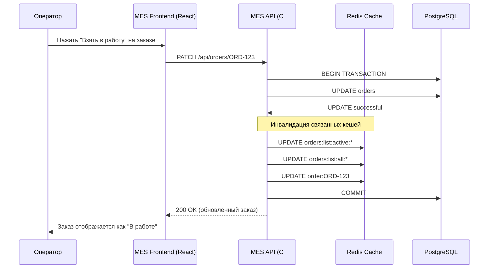

```mermaid
sequenceDiagram
    participant Operator as Оператор
    participant MESFrontend as MES Frontend (React)
    participant MESAPI as MES API (C#)
    participant Redis as Redis Cache
    participant Database as PostgreSQL


    Operator->>MESFrontend: Нажать "Взять в работу" на заказе #ORD-123
    MESFrontend->>MESAPI: PATCH /api/orders/ORD-123

    
    MESAPI->>Database: BEGIN TRANSACTION
    MESAPI->>Database: UPDATE orders 
    Database-->>MESAPI: UPDATE successful
    
    Note over MESAPI,Redis: Инвалидация связанных кешей
    
    MESAPI->>Redis: UPDATE orders:list:active:*
    MESAPI->>Redis: UPDATE orders:list:all:*
    MESAPI->>Redis: UPDATE order:ORD-123
    
    MESAPI->>Database: COMMIT
    
    MESAPI-->>MESFrontend: 200 OK (обновлённый заказ)
    MESFrontend-->>Operator: Заказ отображается как "В работе"

    
```